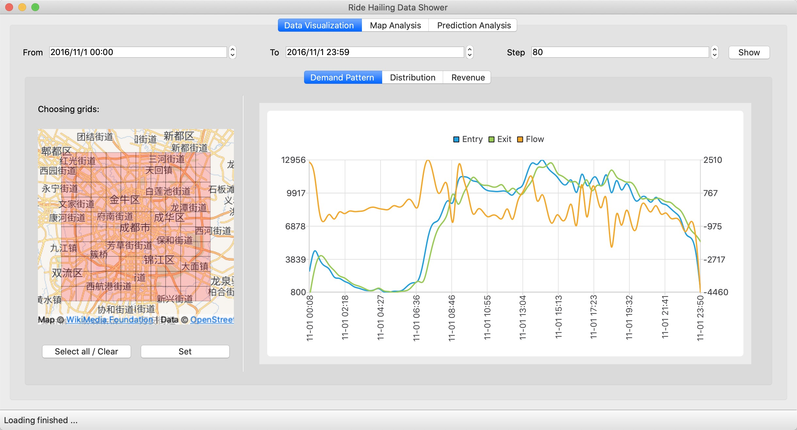

# Quick-Hailer

A Smooth, Graceful and MultiFunctional APP for Analysis and Visualization of Online Ride-Hailing Order Data, which is also the final project of SJTU CS241(Principles and Practice of Problem Solving) Fall 2020.

## Building and Running

1. Open the Quick_Hailer.pro in Qt Creator
2. Choose Desktop Qt 5.12.9 clang 64bit (or other Qt environment in your computer)
3. Build the project
4. Run ../build-Quick_Hailer-Desktop_Qt_5_12_9_clang_64bit-Release/Quick_Hailer.app

Now Quick-Hailer has only been tested on Mac OS 10.15, but in principle it can also work on Windows and Linux.

## Quick Start

After opening the program, you will see this interface. First click "Open ..." to open the Dataset-CS241-2020 folder on your computer. The program will automatically read the file structure and display the fields and time that can be selected, as is shown below:

Choose the fields and dates, click "Load", then the main window will be opened: 

## Functinalities

### Data Visualization

Edit the "From" / "To" to change the time range. Edit the "Step" to change the smoothness of the chart. 

Click "Show", then the status bar will show the progress of loading. When the current chart is refreshed, an animation will be played. 

Also, you can click on the red square in the map to choose the grids you want to take into considerate. The "Select all / Clear" make it convenient to choose or cancel a little bit of grids. 

Then you can click the "Set" to refresh the chart.

You can choose different tabs to watch some other charts.

### Map Analysis

#### Thermal Diagram

Change the "From" / "To" to choose the time range. Change the "spaceStep" to change the size of squares. 

Scroll the "TimeLine" slider, then you can see the change of date and time on the right. Release the slider, then the thermal diagram will be loaded on the map. You can adjust the slider continuously to examine the thermal diagram at different moments.

Click "Play", then the program will automaticly play the changes in your time range. You can edit the "timeStep" to change the number of total steps. 

Click "Overall", then you will see the overall thermal diagram in your time range. 

#### Taxi Flow

Like the "Thermal Diagram", you can edit the "From" / "To" to choose the time range and scroll the timeline. 

You can edit the "spaceStep" to change the level of detail.

The Taxi Flow is also playable, and you can edit the timeStep to change the number of total steps. 

#### Route Planning

Click the push button on the right of "Origin", then click on the map to choose the origin point. 

After that, you can see the address shown in the edit box.

Choose the destination point and click "Route Planning" and wait for a while, you will see the route infomation. 

### Prediction Analysis

#### Route Based Prediction

Like the "Route Planning", choose the origin point and destination point, and then click "Predict", you will get the historical data in the box and the estimated data on the opposite of "Route" label. 

#### Space Based Prediction

Like the "Route Planning", choose the origin point and press the travel time, then click "Predict", you will get the historical data in the map and the corresponding data in the box. 

